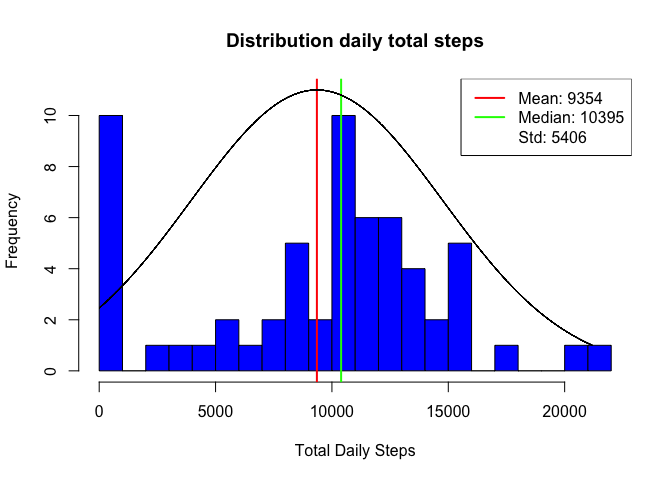
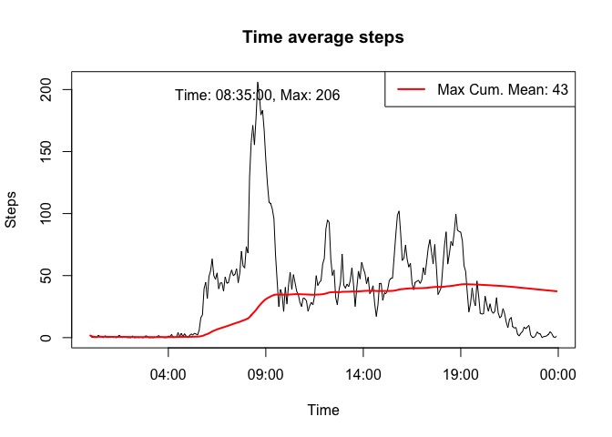
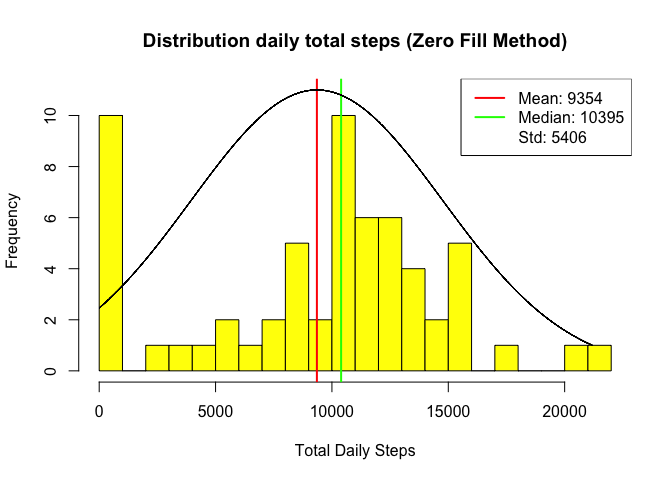
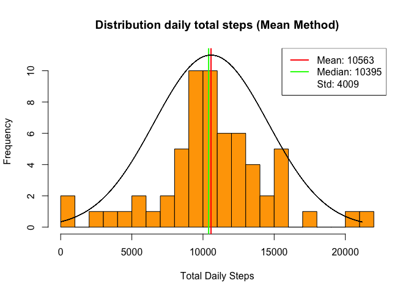
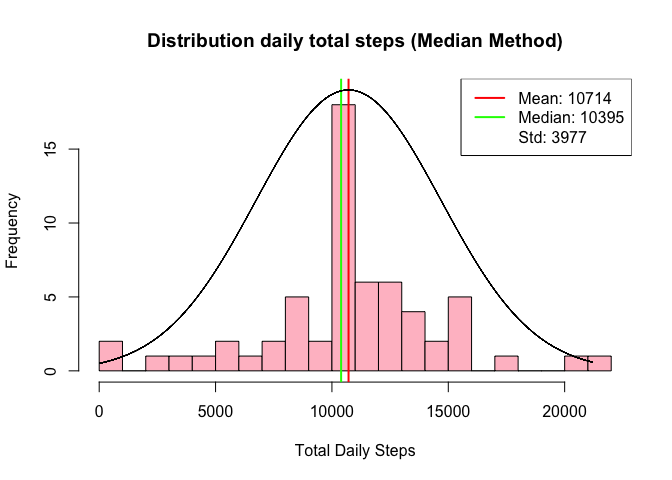
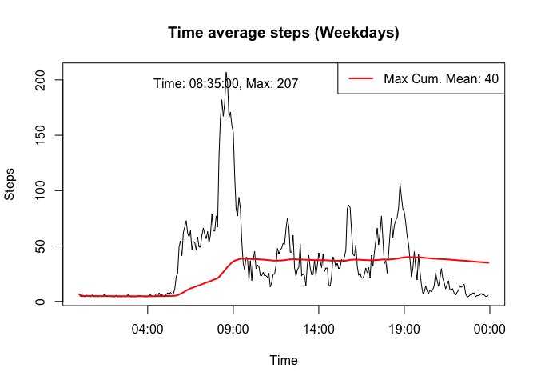
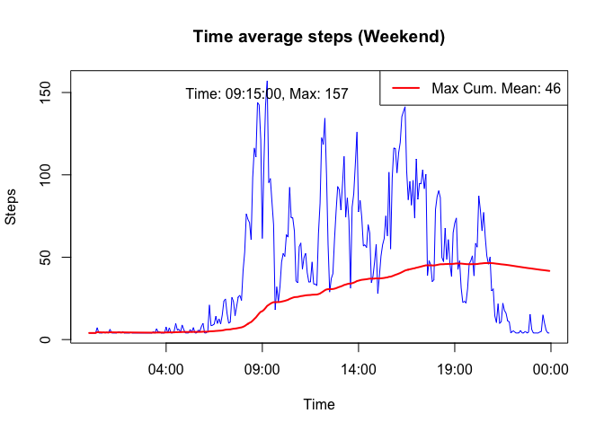
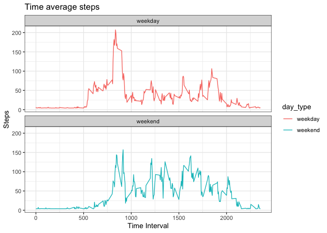

## Environment pre-requisites

Following R packages are required to be loaded:

* tidyverse
* lubridate
* chron
* ggplot2


```r
# Load required packages
library(tidyverse, quietly = TRUE)
```

```
## ── Attaching packages ─────────────────────────────────────── tidyverse 1.3.1 ──
```

```
## ✓ ggplot2 3.3.5     ✓ purrr   0.3.4
## ✓ tibble  3.1.6     ✓ dplyr   1.0.7
## ✓ tidyr   1.1.4     ✓ stringr 1.4.0
## ✓ readr   2.1.0     ✓ forcats 0.5.1
```

```
## ── Conflicts ────────────────────────────────────────── tidyverse_conflicts() ──
## x dplyr::filter() masks stats::filter()
## x dplyr::lag()    masks stats::lag()
```

```r
library(lubridate, quietly = TRUE)
```

```
## 
## Attaching package: 'lubridate'
```

```
## The following objects are masked from 'package:base':
## 
##     date, intersect, setdiff, union
```

```r
library(chron, quietly = TRUE)
```

```
## 
## Attaching package: 'chron'
```

```
## The following objects are masked from 'package:lubridate':
## 
##     days, hours, minutes, seconds, years
```

```r
library(ggplot2, quietly = TRUE)
```
Base plot and ggplot system will used through the exercise. We would like to ensure that the plot panelling are set to default

```r
# Reset base plot setting to default in case
# it was altered
par(mfrow=c(1,1))
```

## Loading and preprocessing the data

We assume that the dataset was unzipped and the raw data file called *activity.csv* is present in the current working directory (repository). Data read directly from the CSV file will go through following transformation:

- Format *"date"* variable to date data structure
- Creation new variable *"weekday"* that translate "date" through weekdays()
- Creation new variable *"interval_time"* from *"interval"* into time data structure through **chron()** function. Variable will be used to plot time series instead of using original interval integer (for clarity reason)
- Creation new variable as factor *"day_type"* set to "weekend" if the weekday in on weekend. Otherwise it is set to "weekday"

The whole data processing is embedded through a function called **process_data**. The processed raw data is stored in variable *processed_raw_data*

```r
# Read Data
raw_data <- read.csv("activity.csv", header = TRUE)

################################################################################
# Function to process raw data by:
#   - Formatting "date" variable to date data structure
#   - Create new variable "weekday" that translate "date" through weekdays()
#   - Create new variable "interval_time" from "interval" into time data structure
#   through chron() function. Variable will be used to plot time series instead of
#   using original interval integer (for clarity reason)
#   - Create new variable as factor "day_type" set to "weekend" if the weekday
#   in on weekend. Otherwise it is set to "weekday"
#
# Function : process_data
# Argument(s):
#   - data : data.frame
# Return:
#   data.frame / NULL
################################################################################
process_data <- function(data) {
    clean_data <- data
    clean_data$date <- as.Date(clean_data$date, "%Y-%m-%d")
    clean_data<- clean_data %>%
        mutate(
            weekday = weekdays(date, abbreviate = FALSE),
            interval_time = chron(times = sprintf(
                "%s:%d:00", interval %/% 100, interval - (interval %/% 100) * 100
            ))
        ) 
    clean_data$day_type <- 
        sapply(
            clean_data$weekday, 
            function(x) {
                if(x %in% c("Saturday", "Sunday")) {
                    "weekend"
                } else {
                    "weekday"
                }
            }
        )
    clean_data$day_type <- as.factor(clean_data$day_type)
    
    # Return processed data frame
    clean_data
}
processed_raw_data <- process_data(raw_data)
head(processed_raw_data)
```

```
##   steps       date interval weekday interval_time day_type
## 1    NA 2012-10-01        0  Monday      00:00:00  weekday
## 2    NA 2012-10-01        5  Monday      00:05:00  weekday
## 3    NA 2012-10-01       10  Monday      00:10:00  weekday
## 4    NA 2012-10-01       15  Monday      00:15:00  weekday
## 5    NA 2012-10-01       20  Monday      00:20:00  weekday
## 6    NA 2012-10-01       25  Monday      00:25:00  weekday
```
Above data printout shows that the raw data has missing values.

## What is mean total number of steps taken per day?

We plot the histogram of distribution of daily total number of steps through the entire experiment. A function called **plot_hist_daily_total_steps** is defined. The function can be later on called with different variant of the dataset in order to compare results (e.g. when processing missing values).

```r
################################################################################
# Function to plot the distribution of the total daily steps for the entire 
# duration of the experiment.
#
# Function : plot_hist_daily_total_steps
# Argument(s):
#   - data : data.frame
#   - plot_title : character array for plot title
#   - plot_color : character array for plot color
# Return:
#   Nothing
###############################################################################
plot_hist_daily_total_steps <- function(data, plot_title="Distribution daily total steps", plot_color="blue") {
    daily <- group_by(data, date)
    daily <- summarise(daily, daily_steps = sum(steps, na.rm = TRUE))
    daily_mean   <- round(mean(daily$daily_steps))
    daily_median <- round(median(daily$daily_steps))
    daily_std    <- round(sd(daily$daily_steps))
    daily_max    <- max(daily$daily_steps)
    num_hist_bin <- 20
    binsize      <- floor(daily_max / num_hist_bin)
    
    # Get the maximum frequency value
    daily_max_freq <- 
        length(
            which(
                (daily$daily_steps >= daily_median - binsize/2) & 
                    (daily$daily_steps <= daily_median + binsize/2) 
            )
        )
    
    # Plot histogram distribution of daily steps
    with(
        daily,
        hist(
            daily_steps,
            nclass = num_hist_bin,
            xlab = "Total Daily Steps",
            ylab = "Frequency",
            ylim = c(0, daily_max_freq),
            main = plot_title,
            col = plot_color
        )
    )
    
    # Draw mean and median lines
    abline(v = daily_mean, col = "red", lwd = 2)
    abline(v = daily_median, col = "green", lwd = 2)
    
    # For visualization purpose fit normal distribution curve
    lines(seq(0,daily_max), (daily_std*sqrt(2*pi))*daily_max_freq*dnorm(seq(0,daily_max), mean = daily_mean, sd = daily_std), col="black")
    
    # Legend
    legend("topright",
           legend =
               c(
                   sprintf("Mean: %.0f", daily_mean),
                   sprintf("Median: %.0f", daily_median),
                   sprintf("Std: %.0f", daily_std)
               ),
           col = c("red", "green", "white"),
           lty = 1,
           lwd = 2
    )
}
plot_hist_daily_total_steps(processed_raw_data)
```

<!-- -->
The histogram has an overlay of a fitting normal distribution curve for illustration purpose only. We do not know the actual distribution of the experiment dataset.

## What is the average daily activity pattern?

We plot the time series of average daily number of steps. Even tough the assessment suggested to keep the original dataset interval as unit, for clarity reason we have transformed the interval unit into actual times stored in times variable *interval_time* in the processed raw dataset. 

```r
################################################################################
# Function to plot the day aggregate average of steps for the entire 
# duration of the experiment.
#
# Function : plot_day_time_average_steps
# Argument(s):
#   - data : data.frame
#   - plot_title : character array for plot title
#   - plot_color : character array for plot color
# Return:
#   Nothing
###############################################################################
plot_day_time_average_steps <- function(data, plot_title="Time average steps", plot_color="black") {
    interval <- group_by(data, interval_time)
    interval <- summarise(interval, avg_steps = mean(steps, na.rm = TRUE))
    
    # Transforming "interval_time" into POSIXct in order to be
    # able to plot it (chron time class is not supported for plotting)
    interval <- mutate(interval, interval_time=strptime(interval_time, format = "%H:%M:%OS"))
    
    # Plot time series of daily average steps
    with(
        interval, 
        plot(
            interval_time,
            avg_steps, 
            type = "l", 
            xlab = "Time",
            ylab = "Steps",
            main = plot_title,
            col = plot_color
        )
    )
    
    # Annotate the maximum average number of steps and at which time interval it
    # occurs
    max <- which.max(interval$avg_steps)
    max_interval_time <<- unlist(strsplit(sprintf("%s", interval[max,]$interval_time), " "))[2]
    max_total_steps <<- round(interval[max,]$avg_steps)
    text(
        interval[max,]$interval_time,
        y = interval[max,]$avg_steps,
        sprintf(
            "Time: %s, Max: %.0f", 
            max_interval_time,
            max_total_steps),
        pos = 1
    )
    
    # Draw cumulative mean curve in order to
    # observe evolution of average number of steps
    # over time
    cumul_mean <- cummean(interval$avg_steps)
    interval_max_mean = round(max(cumul_mean))
    lines(interval$interval_time, cumul_mean, col="red", lwd=2)
    
    # Legend
    legend("topright",
           legend =
               c(
                   sprintf("Max Cum. Mean: %.0f", interval_max_mean)
               ),
           col = c("red"),
           lty = 1,
           lwd = 2
    )
}
plot_day_time_average_steps(processed_raw_data)
```

<!-- -->

The plot has an overlay of the cumulative mean curve which shows the trend of the mean number of steps over time. It is a better metric of the average activity rather than a global single mean value.

The 5-minute interval **08:35:00** is where we have **206** maximum average number of steps.

## Imputing missing values


The current processed dataset has currently **2304** missing values which is equivalent to **13%** of the total dataset.

Before defining an approach on imputing NA value, let's find out where they are located. We have defined a function called **summarize_incomplete_data** which can output a table of all dates where there is at least one NA value with the associated total number of steps.

```r
################################################################################
# Function to extract and summarize only dates where there is at least one
# NAs steps
#
# Function : summarize_incomplete_data
# Argument(s):
#   - data : data.frame
# Return:
#   data.frame
###############################################################################
summarize_incomplete_data <- function(data) {
    nas <- data[is.na(data$steps), ]
    nas <- group_by(nas, date)
    
    # Extract the list of dates where we know there are
    # NAs
    nas_dates <- summarise(nas, sum=sum(steps, na.rm=TRUE))$date
    
    # Take the subset of the original dataset only for the
    # dates where we know we have NAs
    nas <- data[data$date %in% nas_dates,]
    
    # We summarize on selected date the total number of steps
    nas <- group_by(nas, date)
    summarise(nas, total_steps=sum(steps, na.rm=TRUE))
    
}
missing_data_dates <- summarize_incomplete_data(processed_raw_data)
print(missing_data_dates)
```

```
## # A tibble: 8 × 2
##   date       total_steps
##   <date>           <int>
## 1 2012-10-01           0
## 2 2012-10-08           0
## 3 2012-11-01           0
## 4 2012-11-04           0
## 5 2012-11-09           0
## 6 2012-11-10           0
## 7 2012-11-14           0
## 8 2012-11-30           0
```


From above printout, we can see that we have **8** days (or roughly **13%** of days of the entire experiement) where we have missing values. For each of these dates, the total number of steps is zero. In other words, we have only missing values for the entire of these dates. The imputation could be made simpler by altering steps of associated above date with a global single value. We have defined a function called **impute_data** which will create an imputed dataset from the original raw dataset. The function has an argument called *method* which define how to impute missing values. It has 3 possible values:

- **"zero_fill"** : All missing values will replaced by 0
- **"mean"** : All missing values will replaced by overall daily average of total number of steps divided by the number of 5-minute interval in a day (288)
- **"median"** : All missing values will replaced by overall daily median of total number of steps divided by the number of 5-minute interval in a day (288)


```r
################################################################################
# Function to impute NAs steps value from the original processed data set.
# We compute for each day and each hour the average number of steps. For each
# interval where we are missing number of steps we replace it by the date hourly
# average number of steps. However, there are complete days where data are missing.
# For these days
#
# Function : impute_data
# Argument(s):
#   - data : data.frame
#   - method : "mean", "median" or "zero_fill"
# Return:
#   data.frame
###############################################################################
impute_data <- function(data, method="mean") {
    
    # Initialize the completed data frame by its original and retrieve
    # time interval mean and median total number of steps which we would use
    # to impute the missing data
    clean_data <- data
    clean_data <- group_by(clean_data, date)
    daily <- summarise(clean_data, daily_steps = sum(steps, na.rm = TRUE))
    
    # We deriving time interval by dividing daily aggregate
    # measure by 288 (total number of 5-minute interval in a day)
    interval_mean <- round(mean(daily$daily_steps)/288)
    interval_median <- round(median(daily$daily_steps)/288)
    
    # We compute the global interval of steps used for global default imputation
    # based on the chosen method
    global_interval_steps <-
        if(method=="zero_fill") {
            0
        } else if(method=="median") {
            interval_median
        } else {
            interval_mean
        }
    
    # Add "hour" and "time_index" new variables. We would need them
    # to compute the hourly average number of steps
    clean_data$hour <- as.integer(clean_data$interval%/%100)
    clean_data$time_index <- sprintf("%s_%d", clean_data$date, clean_data$hour)
    
    # Create aggregation data frame of hourly chosen method number of steps
    if(method=="median") {
        agg <- aggregate(clean_data$steps, list(clean_data$date, clean_data$hour), median)
    } else {
        agg <- aggregate(clean_data$steps, list(clean_data$date, clean_data$hour), mean)
    }
    names(agg) <- c("date", "hour", "agg_steps")
    agg$time_index <- sprintf("%s_%d", agg$date, agg$hour)
    
    # We still have NAs on hourly aggregated number of steps which we will
    # equate to global default interval number of steps value
    agg[is.na(agg$agg_steps), ]$agg_steps <- global_interval_steps
    
    # Finally, we round the hourly aggregated number of steps to the nearest
    # integer
    agg <- mutate(agg, agg_steps=round(agg_steps))
    
    # Extract the list of dates where data is missing for the entire day
    missing_data_dates <- summarize_incomplete_data(clean_data)
    missing_data_dates <- missing_data_dates[missing_data_dates$total_steps == 0,]$date
    
    # First we perform NA replacement for entire days where data are
    # missing by the global default interval number of steps.
    clean_data[clean_data$date %in% missing_data_dates,]$steps <- global_interval_steps
    
    # Replace remaining NAs in main data frame where in a day there is a mix provided
    # number of steps and missing values.
    for(index in which(is.na(clean_data$steps))) {
        current_time_index <- clean_data[index,]$time_index
        hourly_agg_value <- agg[agg$time_index == current_time_index,]$agg_steps
        if(is.numeric(hourly_agg_value)) {
            
            # Divide the hourly aggregate value by the number of
            # 5-minute interval in an hour (12)
            clean_data[index,]$steps <- round(hourly_agg_value/12)
        } else {
            
            # We set to the global default interval number of steps
            clean_data[index,]$steps <- global_interval_steps
        }
    }
    
    # Return the completed data frame
    clean_data
}
```

For completeness function impute_data can also impute specific 5-minute interval missing values by an equivalent the localized hourly aggregated value where the missing value interval belongs to. The localized hourly aggregated value has 3 possible values based on the selected imputation method:

- **"zero_fill"** : Missing values will replaced by 0
- **"mean"** : Missing values will replaced by localized hourly average of total number of steps divided by the number of 5-minute interval in an hour (12)
- **"median"** : Missing values will replaced by localized hourly median of total number of steps divided by the number of 5-minute interval in an hour (12)

We will create imputated dataset for each imputation method and will compare the daily total number of steps histograms. Function **plot_hist_daily_total_steps** is used to plot histograms.


```r
###############################################################################
# The imputation function provided 3 different type of methods of replacing
# missing values. Let's compare the influence of all 3 methods on the 
# histogram of total number of steps
###############################################################################
# We need to generate the 3 imputed dataset
clean_zero_fill_data <- impute_data(processed_raw_data, method="zero_fill")
clean_median_fill_data <- impute_data(processed_raw_data, method="median")
clean_mean_fill_data <- impute_data(processed_raw_data, method="mean")
```
<!-- -->
<!-- -->
It is expected that both original dataset and zero fill dataset have exactly the same distribution with same mean and same median
<!-- -->
<!-- -->

Original data showed that there is roughly an increase of 1209 steps (~13%) in the daily mean when applying mean imputation and an increase of 1360 steps (~14.5%) on the daily mean when applying median imputation. The median remains unchanged comparing to the original dataset in all 3 cases.

## Are there differences in activity patterns between weekdays and weekends?

For the purpose of the next analysis we will use the *median* imputed
dataset. We plot the time series of number of steps for both weekdays and weekends. We use function **plot_hist_daily_total_steps** to plot the time series.
<!-- -->
<!-- -->

It appears that during weekdays there is a peak of activity during 8am and 9am with an overage number of steps through the day at 35. During the weekend mean steps is higher but no prominent peak at a certain time (even though there is one at 9:15am lower than the weekday peak at 8:35am). A possible  interpretation is the subject do some jogging/paced walking during weekday between 8am and 9am but not on weekend.

For the assessment, it has been asked to plot a multi-panel vis-a-vis curve to show the difference between weekday and weekend activity

```r
final_data <- group_by(clean_mean_fill_data, interval, day_type)
final_data <- summarise(final_data, avg_steps = mean(steps, na.rm = TRUE))
```

```
## `summarise()` has grouped output by 'interval'. You can override using the `.groups` argument.
```

```r
# Plot time series of daily average steps
plot <- ggplot(data=final_data, aes(interval, avg_steps)) +
    geom_line(aes(color=day_type)) +
    facet_wrap(.~day_type, nrow=2, ncol=1) +
    ggtitle("Time average steps") +
    labs(x="Time Interval") +
    labs(y="Steps") + 
    theme_bw()
  print(plot)
```

<!-- -->
